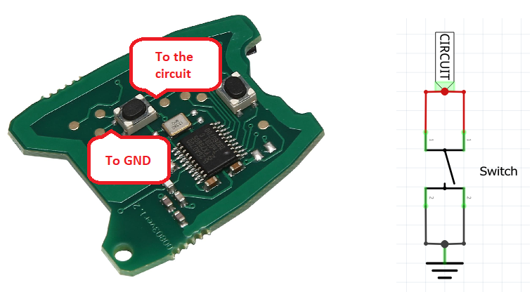
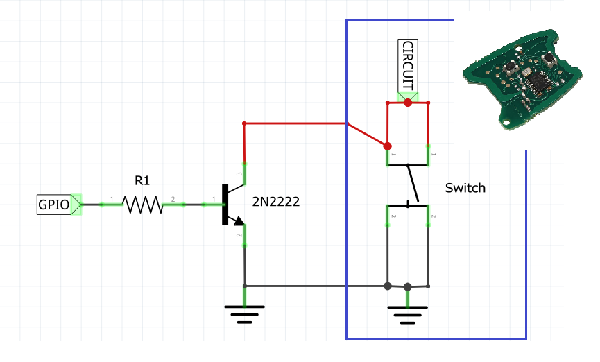

# How to hack a switch on electronic devices and make it smart
Many electronic devices we use everyday, like remote controls or coffee machines, have push buttons. In many cases these buttons are _normally-open_ switches connecting the circuit to ground (GND) as shown in the figure below.

## Hack and make it smart
Use just a common NPN transistor, like the 2N2222, to hack the switch and make it ready to be connected to a MCU's GPIO.

When the `GPIO` value is `HIGH`, the current flowing from B(base) to E(emitter) saturates the transistor, so the circuit on the C(collector) is connected to GND. In this case the transistor acts like the physical switch.

The `R1` value depends on the GPIO voltage. Please refer to the following table for the most common scenarios.

|-|-|-|
|GPIO(V)|R1|Notes|
|3.3V|270|Like in ESP8266 or ESP32.|
|5V||Like in Arduino.|
## To Do
_No improvements scheduled at the moment._
