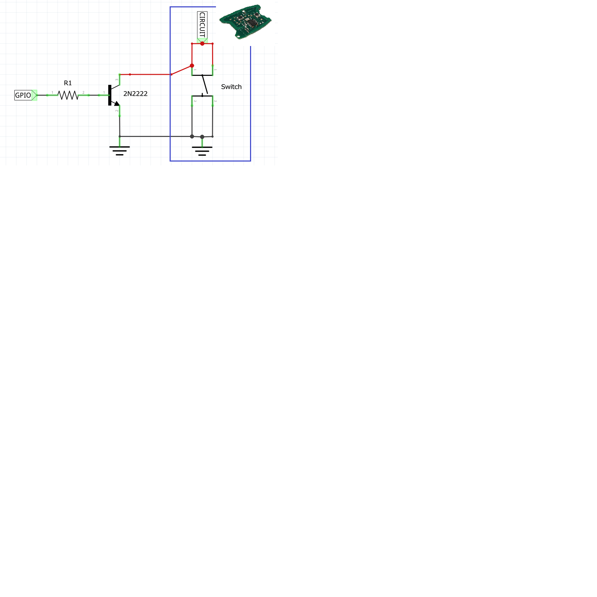

# How to hack a switch on electronic devices and make it smart
Many electronic devices we use everyday, like remote controls or coffee machines, have push buttons. In many cases these buttons are _normally-open_ switches connecting the circuit to ground (GND) as shown in the figure below.

## Hack and make it smart
Use just a common NPN transistor, like the 2N2222, to hack the switch and make it ready to be connected to a MCU's GPIO.

When the GPIO value is high, the current flowing from B(base) to E(emitter) saturates the transistor, so the circuit on the C(collector) is connected to GND simulating the phisical switch.  

